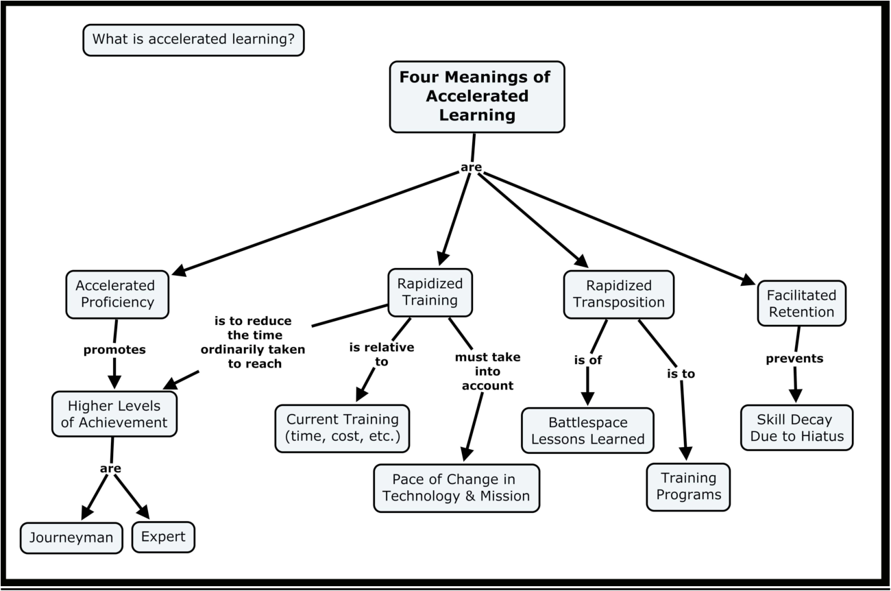
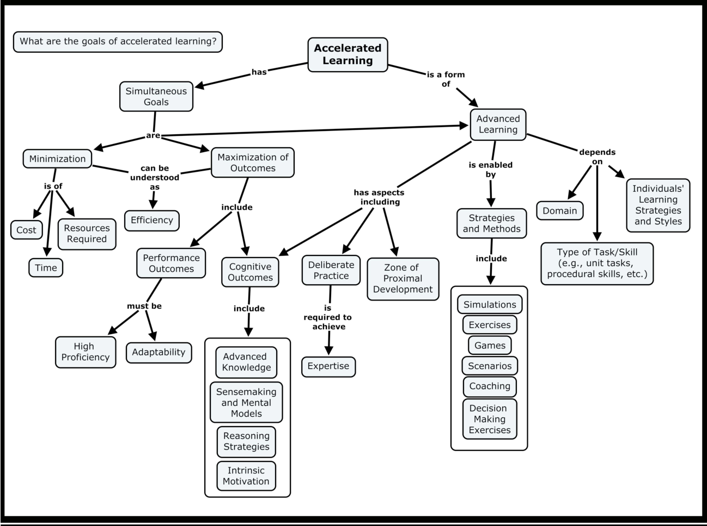

# Expertise

## A land and expand reading program on expertise

- Accelerated Expertise
- The Oxford Handbook of Expertise

Accelerated learning has been defined a number of ways in [Accelerated Proficiency and Facilitated Retention: Recommendations Based on an Integration of Research and Findings from a Working Meeting](https://www.semanticscholar.org/paper/Accelerated-Proficiency-and-Facilitated-Retention%3A-Hoffman-Feltovich/291d0e189963659e0eed0d4bf2a005b1cac2e853).

    <figure class="blog-figure image component image-big image-fullbleed body-copy-wide">
        
        <figcaption class="image-text">Figure 1.1 A concept map about different senses of accelerated learning</figcaption>
    </figure>

1. The first sense is _rapidized training_—the idea of training individuals to achieve some minimal level of proficiency at a rate faster than usual.
2. The second sense is _accelerated proficiency_—the idea of getting individuals to achieve high levels of proficiency at a rate faster than ordinary (i.e., accelerated proficiency).
3. The third sense is _facilitated retention_—the idea of making learning less susceptible to decay.
4. The fourth sense is _rapidized cognitive task analysis_—while both training design and tool design depend crucially on cognitive task analysis, cognitive task analysis (CTA) is understood to be too labor and time-intensive.
5. Fifth and finally, how might _rapidized transposition_ of knowledge from the operational setting to the training setting be brought about? The fast transposition of “lessons learned” from workplace to schoolhouse is a crucial need in many domains, spanning the academy, business, and the military.

Alt

- Rapidized training: attain a minimal level of proficiency in less time.
    - Masses/blocked practice
- Accelerated proficiency: turn an apprentice into an expert in less than ten years.
    - Practice problems that stretch current competency in differing contexts in robust, resilient, and adaptive ways
    - Maintain effectiveness across a range of tasks, situations, and conditions. (Robustness)
    - Recover from a destabilizing perturbation in the work as it attempts to reach its primary goals. (Resilience)
    - Employ multiple ways to succeed and the capacity to move seamlessly among them. (Adaptivity)
- Facilitated retention: maintain a high level of proficiency and minimize the amount of decay
- Rapidized Cognitive Task Analysis
- Rapidized Transposition: quickly transfer lessons learned from the workplace or operational setting into training
    - This requires:
      1. rapid transfer of knowledge from the professional to the trainer without significant increase in anyone’s workload
      2. rapid transformation of the transferred knowledge into products that can be shared, preserved, and readily used by the trainer, and
      3. rapid transmission of the preserved knowledge via the trainer to the trainee.

    <figure class="blog-figure image component image-big image-fullbleed body-copy-wide">
        
        <figcaption class="image-text">Figure 1.2 A concept map about rapidized training and accelerated proficiency</figcaption>
    </figure>

#### Table 2.1 Some features of high proficiency

- The expert is highly regarded by peers.
- The expert’s judgments are accurate and reliable.
- The expert’s performance shows consummate skill (i.e., more effective and/or qualitatively different strategies) and economy of effort (i.e., more efficient).
- For simple, routine activities, experts display signs of “automaticity” where the expert seems to be carrying out a task without significant cognitive load and conscious processing is reserved for strategic control and/or more complex activities.
- The expert possesses knowledge that is fine-grained, detailed and highly organized.
- The expert knows that his knowledge is constantly changing and continually contingent.
- The expert forms rich mental models of cases or situations to support sensemaking and anticipatory thinking.
- The expert is able to create new procedures and conceptual distinctions.
- The expert is able to cope with rare and tough cases.
- The expert is able to effectively manage resources under conditions of high stakes, high risk and high stress.
- Typically, experts have special knowledge or abilities derived from extensive experience with subdomains.
- The expert has refined pattern perception skills and can apprehend meaningful relationships that non-experts cannot.
- Experts are able to recognize aspects of a problem that make it novel or unusual, and will bring special strategies to bear to solve “tough cases.”

#### Table 2.3: Basic proficiency categories based on the traditional craft guild terminology (adapted from Hoffman, 1998)

- **Naïve**: One who is ignorant of a domain.
- Novice: Literally, someone who is new—a probationary member. There has been some (“minimal”) exposure to the domain.
- **Initiate**: Literally, someone who has been through an initiation ceremony—a novice who has begun introductory instruction.
- **Apprentice**: Literally, one who is learning—a student undergoing a program of instruction beyond the introductory level. - Traditionally, the apprentice is immersed in the domain by living with and assisting someone at a higher level. The length of an apprenticeship depends on the domain, ranging from about one to 12 years in the craft guilds.
- **Journeyman**: Literally, a person who can perform a day’s labor unsupervised, although working under orders. An experienced and reliable worker, or one who has achieved a level of competence. It is possible to remain at this level for life.
- **Expert**: The distinguished or brilliant journeyman, highly regarded by peers, whose judgments are uncommonly accurate and reliable, whose performance shows consummate skill and economy of effort, and who can deal effectively with certain types of rare or “tough” cases. Also, an expert is one who has special skills or knowledge derived from extensive experience with subdomains.

#### Key ideas of Cognitive Flexibility Theory (partial Table 4.4)

**Core syllogism**

1. Learning is the active construction of conceptual understanding.
2. Training must support the learner in overcoming reductive explanation.
3. Reductive explanation reinforces and preserves itself through misconception networks and through knowledge shields.
4. Advanced learning is the ability to flexibly apply knowledge to cases within the domain. Therefore, instruction by incremental complexification will not be conducive of advanced learning. Therefore, advanced learning is promoted by emphasizing the interconnectedness of multiple cases and concepts along multiple dimensions, and the use of multiple, highly organized representations.

## A Model of Business Expertise: The Triad

Li DiBello in The Oxford Handbook of Expertise, wrote [Expertise in Business](https://academic.oup.com/edited-volume/34285/chapter-abstract/290669029?redirectedFrom=fulltext&login=false).

> Our research revealed that people who have achieved a high level of business expertise have a deep understanding of the following three core areas: (1) factors involved in effective operations, (2) forces influencing the market, and (3) those driving business finance and economic climates. Consistently successful business leaders have been shown to intuitively understand these areas and their impact on each other, and to pay attention to this fundamental triad in a uniquely dynamic way within a guiding context of business strategy.

One way of describing it is ‘supply/demand/capital’. Another is ‘leadership/strategy/finance’.

1. **Supply, or leadership**: factors involved in effective operations. (Management, org design, incentives, ops…)
2. **Demand, or strategy**: forces influencing the market. (Competition, government, Power, market cycles…)
3. **Capital, or finance**: factors driving business finance and economic climates. (Understanding financial metrics, access to and cost of capital…)

A simple evaluation of your skill might go something like this:
1. What are the operational factors involved in running a business in this industry, and what are you lacking?
2. What are the factors influencing the market for the market you’ve chosen to play in? What do your competitors understand that you do not?
3. What are the financial metrics and capital climate for this particular business? What do your competitors or peers in adjacent markets get that you do not?
4. Can you predict how changes in each leg affect the other two, at least for your specific industry?

It’s the living dynamic between the triad that matters.  E.g., demand goes down, it instantly changes the opportunities and constraints in the other two.

Deliberately and systematically acquire skills in each of the three categories, specific to your particular business, and then — more importantly — *cultivate an understanding of the relationships between the three categories*.

Better business expertise does not come from greater analysis or greater information, but _better ways of structuring or organizing knowledge_.

Business expertise is _distributed cognition_; expertise is spread over a team.

1. **Supply, or leadership**: Develop rich cases of org design, incentive structures, operational rigour, culture, and internal politics.
2. **Demand, or strategy**: Develop rich cases of forces influencing the market: from market shape, competitive analysis, positioning, changing consumer demand, and the ‘path to power’ (from 7 Powers).
3. **Capital, or finance**: Develop rich cases of factors driving business finance and economic climates. Financial concepts like cash flow lockup, return on invested capital, margins, and their relationship with the other two categories.

Internalize the relationships.

Every business is a system, and developing intuition for a system requires you to watch that system in action.

## Service Business Systems Thinking

- Operations
    - Decisions (focus)
    - Change management
    - Communications
    - CUA factor
    - Economic incentives
    - Contractual obligations (policy)
    - Culture “people like us do things like this”
    - Operational rigor
    - Labor skill mix (junior, mid, senior)
- Market
    - Market cycles 🧠
    - Competition
    - Positioning
    - Regulations
- Capital
    - Capital acquisition
    - Capital allocation

Documenting flows over time enables calculating stocks at a point in time.

### Stocks

A stock is measured at one specific time, and represents a quantity existing at that point in time. For example YYYY-MM-DDT00:00:00Z. “I care about viewing this at a specific date and time”.

- Debt (e.g., loans, bonds, notes, mortgages)
- Employees
- Contractors
- Cash reserves
- Clients
- Projects

### Flows

A flow variable is measured over an interval of time.

- YYYY-MM-DDT00:00:00Z – YYYY-MM-DDT24:00:00Z (day)
- YYYY-01-DDT00:00:00Z – YYYY-02-DDT00:00:00Z (month)
- 2000-MM-DDT00:00:00Z – 2001-YY-MMT24:00:00Z (year)
- YYYY-MM-DDT00:00:00Z – YYYY-XX-XXT00:00:00Z (year-to-date)

“I care about viewing this over a period of time”.

### Symbols and functions

- Ν number of new [] in duration (count)
- Σ sum of new [] in duration
- x̄ average of new [] in duration
- Δ new [] in duration compared to new [] in last duration (change)

---

- Ν(Employees) (new hires)
- x̄(Employee duration)
- x̄(Employee satisfaction rating)
- Ν(Contractors)
- x̄(Contractor duration)
- Σ(Debt)
- Σ(Revenue)
- Σ(Payroll spend)
- Σ(Technology spend)
- Σ(Training and Development spend)
- Σ([Ad platform] spend)
- Ν(Marketing emails)
- Ν(Outreach emails)
- Ν([social media platform] posts)
- Ν(Internal meetings)
- x̄(Internal meeting duration)
- x̄(Internal meeting satisfaction rating)
- Ν(Non-client meetings)
- x̄(Non-client meeting duration)
- Ν(Non-client meeting no-shows)
- x̄(Non-client meeting satisfaction rating)
- N(Invoices)
- x̄(N(Invoices) / N(Clients)) “Average invoices per client”
- x̄(Σ(Invoice.amount_paid) / N(Clients)) “Average invoice amount paid per client”
- N(Subscriptions)
- N(Client meetings)
- x̄(Client meeting duration)
- N(Client meeting no-shows)
- x̄(Client meeting satisfaction rating)
- x̄(Project duration)
- N(Tickets)
- x̄(Ticket lead time)
- x̄(Client satisfaction rating)

## Cognitive Agility

For learning to happen people, need to have their old mental models *destroyed through visceral failure*, to make way for new models.

They need to fail hard enough for the game to stop so they examine their patterns of decision making, reconstruct what happened, and compare their results to the ideal results. Only then are people ready to be facilitated to play the game with different results.

People must begin to reflect on their default strategies and examine how a different approach might have accomplished their goals. Only then can people become aware of the assumptions guiding their decisions under pressure and the attendant results. They must 'deconstruct' their decisions before they can 'reorganize'.

### Cognitive Transformation Theory
#### Core Idea
Learning consists of the *elaboration and replacement of mental models*. Mental models are limited and include knowledge shields. Knowledge shields lead to wrong diagnoses and enable the discounting of evidence.
Therefore **learning must also involve unlearning**.

#### Additional Propositions in the Theory
- Mental models are reductive and fragmented; therefore incomplete and flawed.
- Learning is the refinement of mental models. Mental models provide causal explanations.
- Experts have more detailed and more sophisticated mental models than novices. Experts have more accurate causal mental models.
- Flawed mental models are barriers to learning (knowledge shields).
- Learning is by sense-making (discovery, reflection) as well as by teaching.
- Refinement of mental models entails at least some un-learning (accommodation; restructuring, changes to core concepts).
- Refinement of mental models can take the form of increased sophistication of a flawed model, making it easier for the learner to explain away inconsistencies or anomalous data.
- Learning is discontinuous. (Learning advances when flawed mental models are replaced, and is stable when a model is refined and gets harder to disconfirm.)
- People have a variety of fragmented mental models. “Central” mental models are causal stories.

Cognitive Transformation Theory tells us that people learn when they replace flawed mental models with better ones, as a result of trial and error cycles.

What makes one person more effective at trial and error when compared to another? Well, Cognitive Transformation Theory tells us that their effectiveness is limited by their ability to *unlearn previous mental models in the pursuit of better, more effective new ones*.

**Sensemaking is to deliberately discover what is wrong with one’s mental models and to abandon and replace them**.

As expertise increases, the work needed to replace flawed mental models *goes up*.

A training program to accelerate expertise should be optimized to *break knowledge shields, and quickly*. Teams must fail in a very rapid, public manner, within a simulation that *feels* like the real company they work in. Visceral failure enables the ‘deconstruction’ phase, allowing 'reorganization' of the company’s mental models.

Most people must be violently shown that their models are deficient before they are willing to learn new ones.

[You can’t teach what they aren’t ready to know](https://commoncog.com/blog/you-cant-teach-what-they-arent-ready-to-know/)

## Strategic Rehearsals

Given an idea, look for a history of application. Look for an application of how this can be useful.

## Cognitive Flexibility Theory

Cognitive Flexibility Theory (CFT) is a theory of expertise in ill-structured domains.

Concepts in computer programming (e.g., variables, loops) always show up in the exact same way—computer programming is a well structured domain. Well-structured domains are domains where concepts show up in the exact same way.

Concepts in software design often vary with the details of the problem—software design is an ill-structured domain. Ill-structured domains are domains where concept instantiations are highly variable.

Expertise in a well-structured domain is suited towards understanding principles.

Expertise in an ill-structured domain is suited towards having examples of concept instantiations. You need to know examples of principles _in action_. Principles or frameworks are not enough, as the concept are highly variable. Experts in ill-structured domains can reason by combining examples of concept instantiations.

In ill-structured domains, universal principles apply themselves  in so many different ways that knowing the ways and contexts they show up is more important than knowing the principles. No framework perfectly captures the novelty of real-world situations.

You have to compare cases—what’s similar? Does it remind you of a particular case—if no, what’s different?

## Extracting Expertise

> The most important lessons from history are the takeaways that are so broad they can apply to other fields, other eras, and other people. That’s where lessons have leverage and are most likely to apply to your own life.
> — [Morgan Housel](https://collabfund.com/blog/five-lessons-from-history/)

[HIG Interrogation Best Practices Report](https://www.fbi.gov/file-repository/hig-report-august-2016.pdf/view)

- [Venkatesh Rao: Thinking in OODA Loops](https://www.ribbonfarm.com/2021/12/06/thinking-in-ooda-loops/)
- [Cedric Chin: Much Ado About The OODA Loop](https://commoncog.com/much-ado-about-the-ooda-loop/)
- [Cedric Chin: Ability to See Expertise is a Milestone Worth Aiming For](https://commoncog.com/seeing-expertise-milestone-worth-aiming-for/)
- [Mapping the Unknown – The Ten Steps to Map Any Industry](https://steveblank.com/2022/09/20/mapping-the-unknown-the-ten-steps-to-map-any-industry/)

## Pursuit of knowledge

- Commoncog series on [Becoming Data Driven in Business](https://commoncog.com/becoming-data-driven-in-business/)
    - [Goodhart's Law Isn't as Useful as You Might Think](https://commoncog.com/goodharts-law-not-useful/)
    - [How to Become Data Driven](https://commoncog.com/how-to-become-data-driven/)
    - [Operational Excellence is the Pursuit of Knowledge](https://commoncog.com/operational-rigour-is-the-pursuit-of-knowledge/)
    - [There is No Truth in Business, Only ‘Knowledge’](https://commoncog.com/no-truth-in-business-only-knowledge/)
    - [Process Behaviour Charts](https://commoncog.com/process-behaviour-charts-more-than-you-need/)
    - [What to Think When Looking at a Chart](https://commoncog.com/how-to-read-chart)
- [Can simpler technology produce better learning outcomes?](https://medium.com/accelerating-expertise/thoughts-on-training-fidelity-f2b9a0de193e)
- [Stumbling Towards Rightness](https://nathanbrixius.wordpress.com/2023/05/05/stumbling-towards-rightness/)
- [Embrace Complexity; Tighten Your Feedback Loops](https://ferd.ca/embrace-complexity-tighten-your-feedback-loops.html)
- [Scaling tacit knowledge](https://nintil.com/scaling-tacit-knowledge/)

### Reading list

#### Operations

- (1984) Eliyahu M. Goldratt - The Goal: A Process of Ongoing Improvement
- (1989) Dietrich Dörner - The Logic of Failure: Recognizing and Avoiding Error in Complex Situations
- (1993) Donald J. Wheeler - Understanding Variation: The Key to Managing Chaos

#### Market

- (2016) [Hamilton Helmer - 7 Powers](/power/)
- (2020) Bob Moesta - Demand Side Sales 101

#### Capital

- (2012) Will Thorndike - The Outsiders
- (2015) Marathon Asset Management - Capital Returns: Investing Through the Capital Cycle
